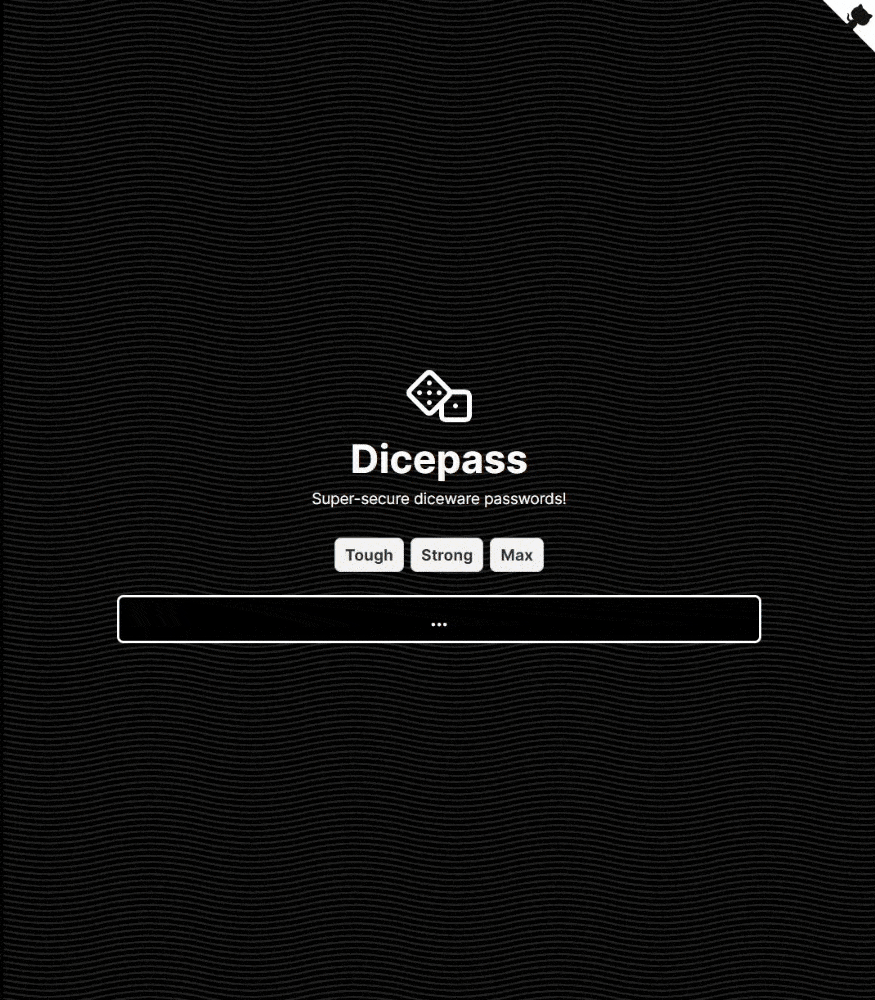

# Dicepass 

Dicepass is a simple and easy to use diceware password generator! Words are retreived from an API that contains over 200,000 words and combined, making a passphrase. This is different from the regular diceware wordlist of 7776, but possibly even more secure.

## Important Note

I found out right before completing this project that there was already another existing diceware password generator called dicepass, created by Eran Sandler in 2016. This generator isn't affiliated with them in any way, and I wasn't aware that the other dicepass existed until the day I deployed this project.

## Screen Capture

## License

Dicepass is listed under the MIT license, so you can copy, distrubute, or do pretty much whatever you want to with it!
